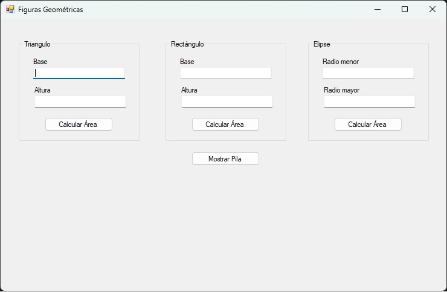

# Examen Práctico de CURSO DE TECNOLOGÍAS .NET [MÓDULO 1: C#]

<p align="center"></p>

## 📌 Descripción
Este proyecto corresponde al examen práctico del **Módulo 1: C#** del curso de Tecnologías .NET.  
El objetivo es aplicar conceptos de **programación orientada a objetos** y **Windows Forms** para crear una aplicación que gestione figuras geométricas mediante una pila.

---

## 📖 Instrucciones del examen
- Crear la clase **FiguraGeometrica** con el atributo:
	- `nombre` (string)
- Crear la interfaz **IPoligono** con el método:
  
  ```csharp
  public double Area(double valor1, double valor2);

- Crear la clase (que heredan de **FiguraGeometrica** e implementan **IPoligono**):
	- **Triangulo, Rectangulo y Elipse** (con sus atributos pertinentes y método **ToString()** que retorne un texto mostrando el nombre y su área calculada)

- En la ventana de la aplicación se contará con tres pequeños formularios:
	- Uno para ingresar atributos que conformen un triángulo.
	- Un segundo formulario para rectángulo.
	- Un tercer formulario para eclipse.

	cada pequeño formulario contará con un botón para crear dicho objeto e ingresarlo en una pila de polígonos.

- Finalmente, debe existir un botón “Mostrar pila” que mostrará, en un label, los
elementos dentro la pila (siempre debe mostrar los elementos que estén dentro,
no eliminarlos).


